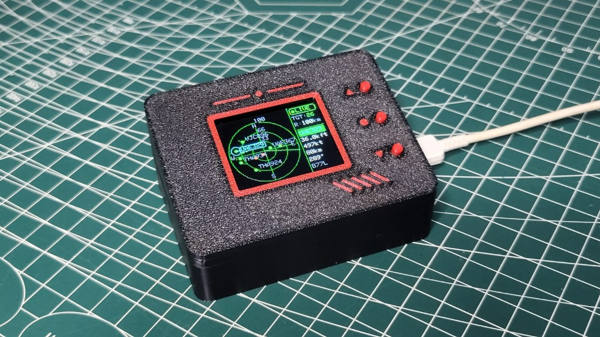
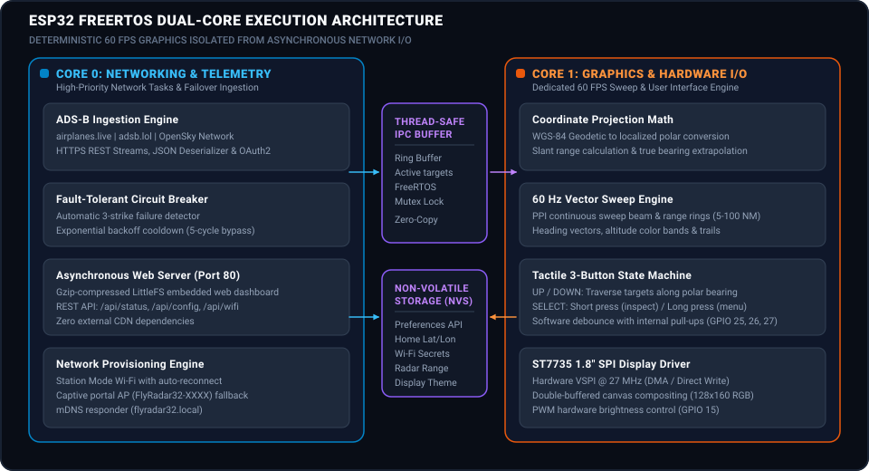
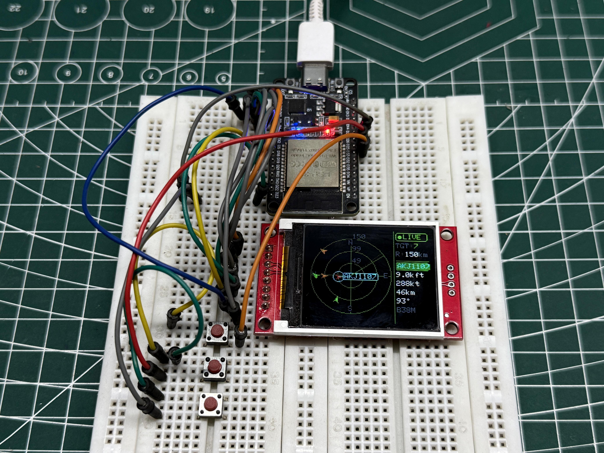
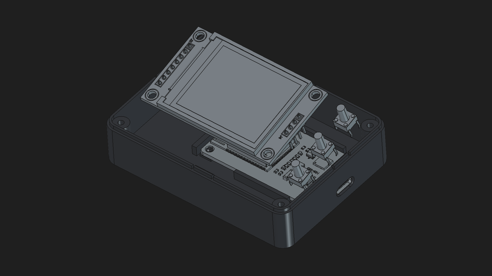
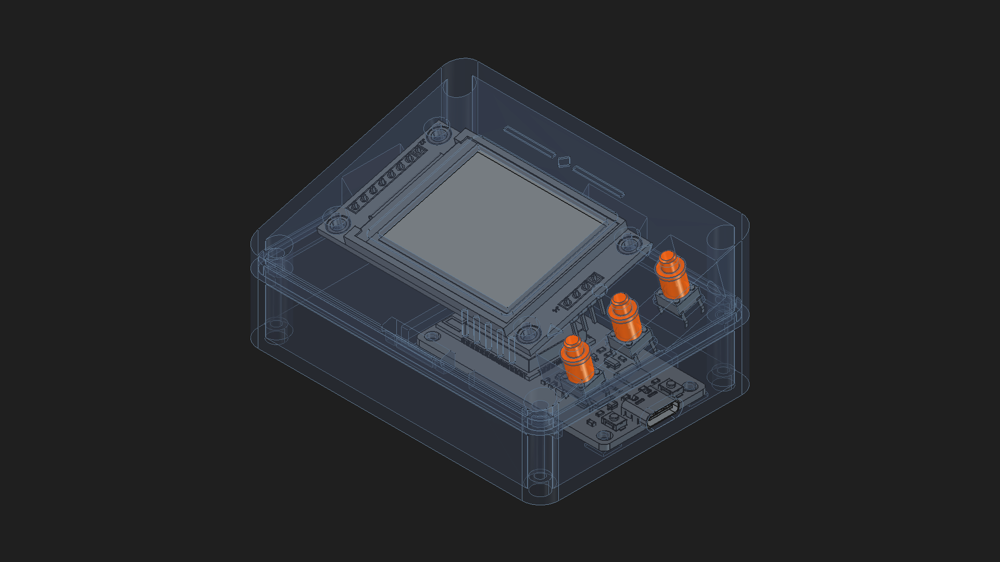
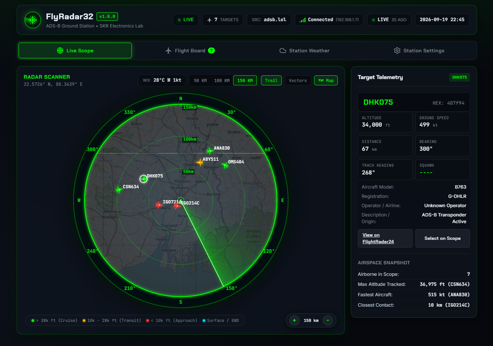
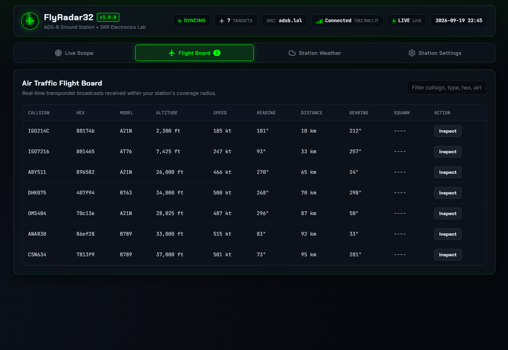
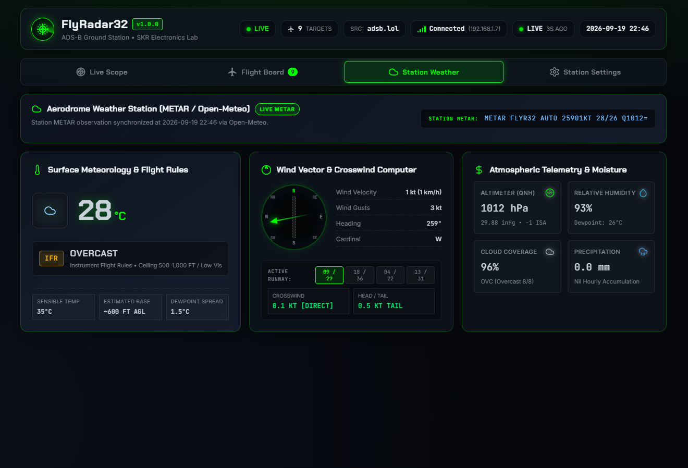
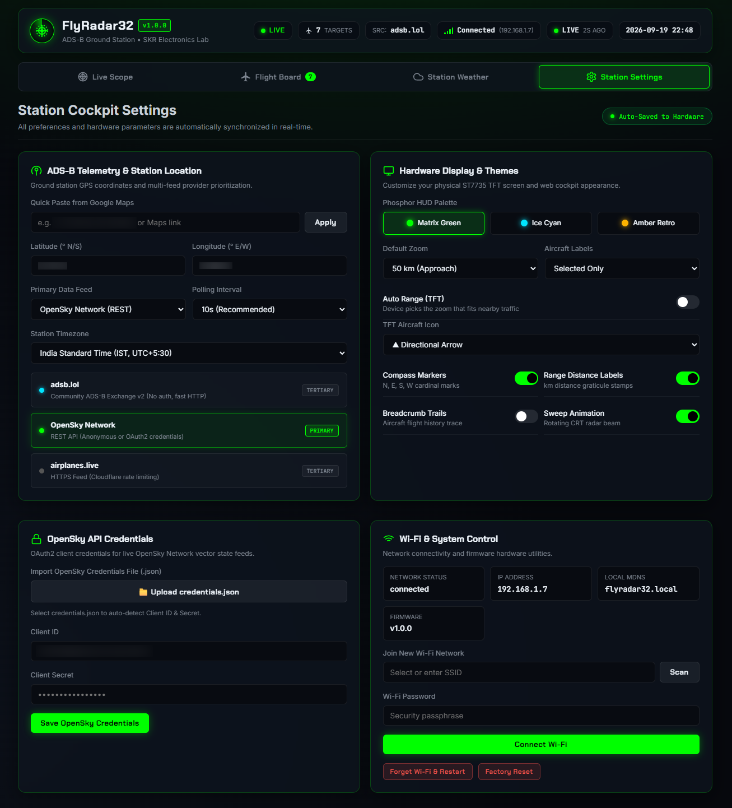

# FlyRadar32

### Autonomous Desktop ADS-B Flight Radar and Avionics Ground Station

FlyRadar32 is a standalone desktop aviation instrument powered by an ESP32 dual-core microcontroller and a 1.8-inch ST7735 SPI display. It aggregates real-time ADS-B transponder telemetry from global flight tracking networks, computes spatial trajectories, and renders a sweeping 60 FPS PPI (Plan Position Indicator) radar display without requiring an external computer or cloud intermediary.

<div align="center">

[](LICENSE)
[](https://www.espressif.com/)
[](https://platformio.org/)
[](include/radar_display.h)

<p align="center">
  <a href="https://ko-fi.com/skrelectronicslab">
    
  </a>
</p>



</div>

---

## Table of Contents

- [System Architecture](#system-architecture)
- [Key Features](#key-features)
- [Hardware Specification and BOM](#hardware-specification-and-bom)
- [Circuit Diagram and Physical Prototype](#circuit-diagram-and-physical-prototype)
- [3D Printable Enclosure](#3d-printable-enclosure)
- [Embedded Web Dashboard](#embedded-web-dashboard)
- [Firmware Build and Deployment](#firmware-build-and-deployment)
- [First Boot and Captive Portal](#first-boot-and-captive-portal)
- [REST API Specification](#rest-api-specification)
- [GitHub Repository Topics](#github-repository-topics)
- [Author and Support](#author-and-support)
- [License](#license)

---

## System Architecture

FlyRadar32 segregates workloads across both symmetric Xtensa LX6 CPU cores using FreeRTOS tasks to guarantee deterministic screen refresh rates regardless of network latency:

<div align="center">



</div>

- **Core 0 (Networking & Telemetry Pipeline):**
  Executes HTTP/TLS REST requests, handles JSON deserialization, runs the automated failover circuit breaker across ADS-B data providers, and serves the embedded web dashboard.
- **Core 1 (Real-Time Graphics Pipeline):**
  Drives the ST7735 display over high-speed SPI (27 MHz). Performs double-buffered polar coordinate projection, renders heading vectors and history trails, and samples tactile push buttons with state debounce logic.

---

## Key Features

- **Live Multi-Target ADS-B Tracking:** Decodes ICAO 24-bit transponder addresses, callsigns, barometric/geometric altitude, ground speed (knots), track heading (degrees), and vertical rate (feet/min).
- **Tri-Tier Provider Redundancy:** Integrates `airplanes.live`, `adsb.lol`, and `OpenSky Network`. An automated circuit breaker detects consecutive network timeouts (3 strikes) and applies a cooldown backoff to prevent API starvation.
- **Precision Polar Radar Graphics:** Plan Position Indicator (PPI) with a continuous sweep line, concentric range rings (5, 10, 25, 50, 100 NM), cardinal compass headings, and target history breadcrumb trails.
- **Self-Contained Embedded Web Dashboard:** Zero-dependency responsive control panel served directly from ESP32 flash with live radar maps, target flight board, weather telemetry, coordinate calibration, Wi-Fi management, and display preferences.
- **Captive Portal Field Deployment:** Launches an autonomous setup Access Point (`FlyRadar32-XXXX`) if configured Wi-Fi credentials fail, automatically redirecting connected mobile or desktop browsers to the provisioning console.
- **Non-Volatile Configuration Memory:** Home coordinates, range limits, display brightness, screen themes, and API credentials persist across power cycles in ESP32 Non-Volatile Storage (NVS).

---

## Hardware Specification and BOM

| Component | Specification | Quantity | Reference Source |
|-----------|---------------|----------|------------------|
| Microcontroller | ESP32-WROOM-32 (30-Pin DevKit, 4MB Flash) | 1 | Espressif Systems |
| Display | 1.8" TFT ST7735 (128x160 RGB, 4-Wire SPI) | 1 | Black-Tab / Red-Tab |
| User Input | 6x6x3.8mm Momentary Tactile Push Buttons | 3 | SPST Through-Hole |
| Enclosure | 3-Piece Precision FDM Chassis (PETG / PLA) | 1 Set | [enclosure/](enclosure/) |
| Power Source | 5V USB-C or Micro-USB (500mA minimum) | 1 | Standard USB Port |

---

## Circuit Diagram and Physical Prototype

### Live Hardware Prototype

<div align="center">



*FlyRadar32 standalone hardware tracking active aviation target AKJ1107 (Boeing 737 MAX 8) on a 1.8" ST7735 SPI display.*

</div>

### Schematic Circuit Diagram

<div align="center">


</div>

### Pinout Mapping

| Function | ESP32 GPIO | Peripheral Pin | Description |
|----------|------------|----------------|-------------|
| Display SCLK | GPIO 18 | SCK / CLK | Hardware VSPI Clock (27 MHz) |
| Display MOSI | GPIO 23 | SDA / DIN | Hardware VSPI Data |
| Display CS | GPIO 5 | CS | Chip Select (Active Low) |
| Display DC | GPIO 2 | DC / AO | Data / Command Select |
| Display RST | GPIO 4 | RES / RESET | Hardware Reset |
| Display BL | GPIO 15 | BL / LED | Backlight Control |
| Display VCC | 3V3 Rail | VCC | 3.3V Power Rail |
| Display GND | GND Rail | GND | Common Ground |
| Button UP | GPIO 25 | Pin 1 to GPIO, Pin 2 to GND | Target cursor clockwise traverse |
| Button DOWN | GPIO 26 | Pin 1 to GPIO, Pin 2 to GND | Target cursor counter-clockwise traverse |
| Button SELECT | GPIO 27 | Pin 1 to GPIO, Pin 2 to GND | Short: Detail / Long: Menu |

> **Strapping Pin Notice:** Do not connect pull-down loads or switches to GPIO 0, GPIO 12, or GPIO 15 that force unexpected boot logic levels.

---

## 3D Printable Enclosure

The desktop enclosure features an ergonomic 15-degree instrument slant, internal snap-latch joints, zero exterior screws, and anti-fallout button actuators.

All 3D models and print documentation are located in the [enclosure/](enclosure/) directory:

<div align="center">

| Internal Seating | Transparent Assembly |
|:---:|:---:|
|  |  |

</div>

### Printable Files

- [`enclosure/flyradar32_shell.stl`](enclosure/flyradar32_shell.stl) — Bottom chassis with ESP32 board rails and USB collar.
- [`enclosure/flyradar32_lid.stl`](enclosure/flyradar32_lid.stl) — Top bezel with 15° instrument tilt and display aperture.
- [`enclosure/flyradar32_button_caps.stl`](enclosure/flyradar32_button_caps.stl) — 3x tactile actuator keycaps with retention lips.
- [`enclosure/FlyRadar32_Enclosure.FCStd`](enclosure/FlyRadar32_Enclosure.FCStd) — Master parametric CAD file (FreeCAD).

### Print Parameters

- **Layer Height:** 0.20 mm (0.16 mm for keycaps)
- **Walls / Perimeters:** 3
- **Infill:** 20% Gyroid or Grid
- **Material:** PETG or PLA
- **Supports:** None required (All geometries self-supporting <= 45°)

---

## Embedded Web Dashboard

FlyRadar32 serves an asynchronous, zero-dependency web interface directly from internal LittleFS flash storage.

<div align="center">

| Live Radar Scope | Air Traffic Flight Board |
|:---:|:---:|
|  |  |

| Station Weather | Station Settings |
|:---:|:---:|
|  |  |

</div>

- **Live Scope:** Real-time canvas radar scope displaying aircraft positions, heading vectors, altitude color bands, and range scaling.
- **Flight Board:** Tabular air traffic ledger with callsign search, hex code, altitude, speed, heading, and distance sorting.
- **Station Weather:** Live local barometric and meteorological telemetry report.
- **Station Settings:** Coordinate calibration, Wi-Fi network switching, refresh intervals, and display themes.

---

## Firmware Build and Deployment

PlatformIO automatically compresses web assets from `data/` into Gzip byte arrays during compilation.

```bash
# Clone the repository
git clone https://github.com/skrelectronicslab/flyradar32.git
cd flyradar32

# Compile firmware
pio run

# Flash firmware over USB
pio run --target upload

# Open serial telemetry monitor (115200 baud)
pio run --target monitor
```

---

## First Boot and Captive Portal

1. **Power-On:** If no Wi-Fi credentials are saved, the device hosts an Access Point named `FlyRadar32-XXXX` (passphrase: `radar1234`).
2. **Setup Portal:** Connect to the AP from a mobile phone or laptop. The browser automatically navigates to `http://192.168.4.1`.
3. **Configure:** Select your Wi-Fi SSID, enter the password, and set your observer coordinates.
4. **Operation:** The device connects to your network, displays its assigned IP address on the screen, and starts tracking live aircraft.

---

## REST API Specification

FlyRadar32 exposes a lightweight HTTP REST API for integration into Home Assistant, Node-RED, or custom telemetry dashboards:

| Method | Endpoint | Description | Sample Output / Payload |
|--------|----------|-------------|-------------------------|
| `GET` | `/api/status` | Current radar telemetry and aircraft list | `{"uptime":3600,"wifi":"OK","aircraft_count":12,"targets":[...]}` |
| `GET` | `/api/config` | Read active system parameters | `{"lat":37.7749,"lon":-122.4194,"range":25,"theme":0}` |
| `POST` | `/api/config` | Update system parameters | `{"lat":51.5074,"lon":-0.1278,"range":50}` |
| `GET` | `/api/wifi/scan`| Scan for 2.4GHz Wi-Fi networks | `[{"ssid":"HomeNet","rssi":-58,"secure":true}]` |
| `POST` | `/api/wifi/connect`| Save Wi-Fi credentials and connect | `{"ssid":"HomeNet","password":"secretpassword"}` |
| `POST` | `/api/restart` | Issue software reboot | `{"status":"restarting"}` |

---

## GitHub Repository Topics

Add the following tags in your GitHub repository settings under **About -> Topics**:

```text
esp32, ads-b, flight-radar, aviation, radar-display, st7735, freertos, platformio, embedded-systems, cplusplus, 3d-printing, freecad, opensky-network, iot, open-source-hardware
```

---

## Author and Support

FlyRadar32 is designed and developed by **Raihan (SK Raihan)**.

- **Organization:** SKR Electronics Lab / SKR Projects Hub
- **YouTube:** [@skr_electronics_lab](https://youtube.com/@skr_electronics_lab)
- **Instagram:** [@skr_electronics_lab](https://instagram.com/skr_electronics_lab)
- **X (Twitter):** [@skrelectronics](https://twitter.com/skrelectronics)
- **Email:** `skrelectronicslab@gmail.com`

If you enjoy this open-source project and want to support ongoing development, consider buying a coffee on Ko-fi:

<div align="center">

[](https://ko-fi.com/skrelectronicslab)

</div>

---

## License

This project is licensed under the [MIT License](LICENSE).
