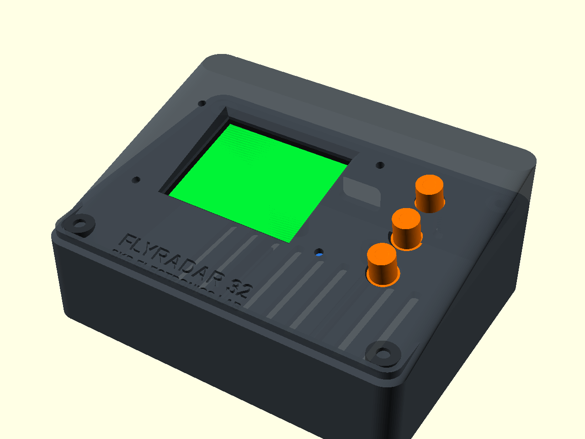
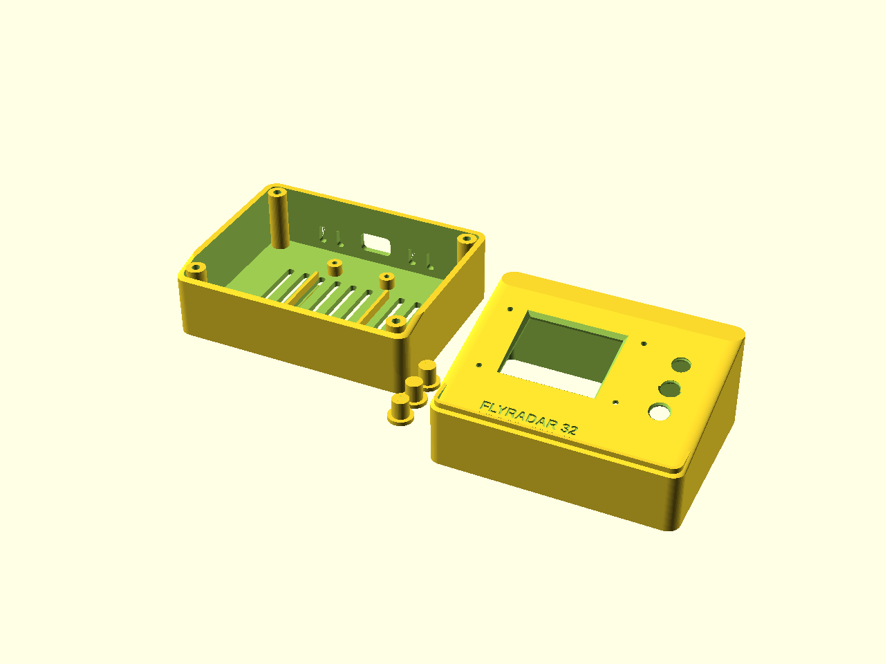

# FlyRadar32 3D Printable Desktop Enclosure

A custom, avionics-inspired desktop ATC radar console enclosure designed specifically for the **FlyRadar32** ground station.



---

## 🧰 Hardware & Compatibility

| Component | Specification | Notes |
|---|---|---|
| **Microcontroller** | ESP32 DevKit V1 (30-pin or 38-pin) | Slotted cradle with side retention guides |
| **Display** | 1.8" ST7735 128×160 SPI TFT (Red PCB) | 4-point corner mount with chamfered bezel |
| **Buttons** | 3× 6×6mm tactile pushbuttons | UP, SELECT, DOWN with printable actuator caps |
| **Fasteners** | 4× M3 × 16mm screws | Bottom countersunk (no visible screws on face) |
| **Thread Inserts** | 4× M3 heat-set brass inserts (OD ~4.2mm) | *Optional* — screws can also self-tap directly |
| **Display Screws**| 4× M2 × 4mm or M2 × 6mm self-tapping | For securing the ST7735 PCB to the bezel |
| **Desk Feet** | 4× 8mm rubber adhesive bumpers | Recessed circular slots in bottom chassis |

---

## 📐 Design Features

- **Ergonomic Desktop Incline**: 12.2° inclined face for natural viewing angles on your desk while seated.
- **Clean Avionics Aesthetics**: Clean, screw-free front face; debossed `FLYRADAR 32` and `SKR ELECTRONICS LAB` branding.
- **Captive Button Caps**: 3D-printed button caps feature an internal retention flange so they cannot fall out from the exterior.
- **Passive Thermal Ventilation**: Dual ventilation louvers (bottom chassis and rear panel) ensure continuous convective cooling for the ESP32 Wi-Fi radio.
- **Clean Cable Access**: Rear-facing USB port cutout sized to accommodate standard Micro-USB and USB-C cable heads.
- **Interlocking Mating Lip**: 2mm perimeter tongue-and-groove joint between top and bottom halves prevents light bleed and ensures rigid alignment.

---

## 🖨️ 3D Printing Guidelines



### Recommended Slicer Settings
- **Material**: PETG, PLA, or ABS/ASA (Matte Black, Dark Navy, or Slate Grey recommended).
- **Layer Height**: `0.20 mm` (or `0.16 mm` for ultra-smooth bevels).
- **Perimeters / Walls**: `4 to 6 walls` (for solid structural rigidity around screw bosses).
- **Infill**: `20%` (Gyroid or Grid).
- **Supports**:
  - `bottom_case`: **No supports required** (prints flat on base).
  - `button_caps`: **No supports required** (prints flat on flange).
  - `top_bezel`: Minimal tree supports under the internal hollow cavity.

---

## 💻 OpenSCAD Customization

The `.scad` model is 100% parametric. Open [`flyradar32_case.scad`](flyradar32_case.scad) in OpenSCAD and use the **Customizer** panel:

- `part = "assembly"` — 3D color-coded preview with hardware mockups.
- `part = "top"` — Top bezel oriented for export.
- `part = "bottom"` — Bottom chassis oriented for export.
- `part = "buttons"` — Set of 3 button caps.
- `part = "plate"` — Complete print bed layout with all parts arranged for a single print job.

### Exporting STLs via Command Line
```powershell
# Export Bottom Chassis
& "C:\Program Files\OpenSCAD\openscad.com" -o flyradar32_bottom.stl -D 'part=\"bottom\"' flyradar32_case.scad

# Export Top Bezel
& "C:\Program Files\OpenSCAD\openscad.com" -o flyradar32_top.stl -D 'part=\"top\"' flyradar32_case.scad

# Export Button Caps
& "C:\Program Files\OpenSCAD\openscad.com" -o flyradar32_buttons.stl -D 'part=\"buttons\"' flyradar32_case.scad
```
